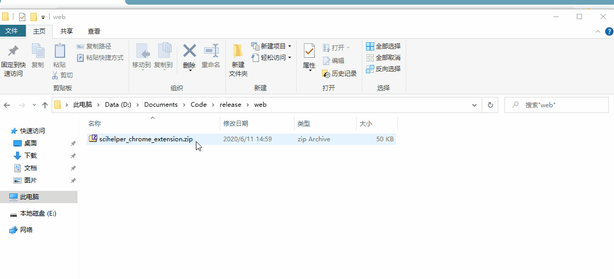

# SCI Helper

Help you find the accessible paper with the DOI.

> For example: `10.1016.12.31/nature.S0735-1097(98)2000/12/31/34:7-7`
## Chrome extension

Import `chrome_extension` after enable developer model in your chrome as follows.

## TODO

- [ ] Support PMID
- [ ] Desktop client