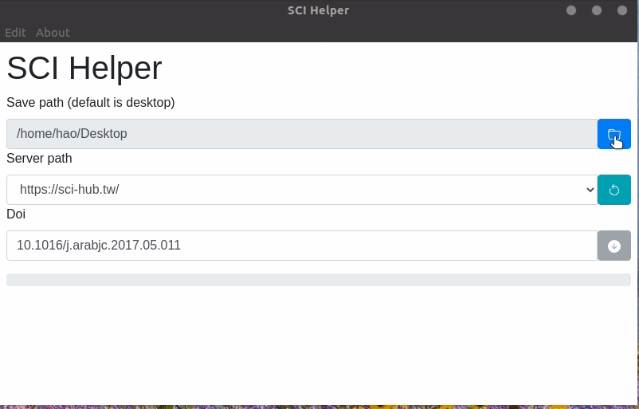

# SCI Helper

Help you find the accessible paper with the DOI.

> For example: `10.1016.12.31/nature.S0735-1097(98)2000/12/31/34:7-7`

## Chrome extension

Import `chrome_extension` after enable developer model in your chrome as follows.

## Desktop client

Build with Electron, you can choose the saved path, and the download server.

## How To Install

For chrome extension, please check [Chrome extension](#chrome-extension);

For desktop client, please download in the [release](https://github.com/Waynehfut/scihubhelper/releases).

## TODO

- [ ] Support PMID
- [ ] Title search
- [ ] User setting
